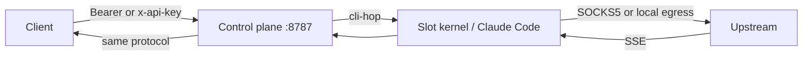

# What is vm2api?

vm2api turns an **Anthropic** subscription (Claude Pro, Team, Enterprise, or Max) or an **OpenAI** subscription (ChatGPT / Codex) into a normal API on your own machine.

The caller speaks a standard protocol. The slot behind it runs the official client in an isolated container, or in KVM / QEMU when you choose a real virtual machine. Hardware identity (SMBIOS, MAC, machine-id), the network exit, and the credential all belong to that slot.

This help site matches the product tree at **1.3.131**. Install scripts track the latest GitHub release, which may be newer.

## What you get

| You call | Upstream |
| --- | --- |
| `POST /v1/messages` | Anthropic Messages |
| `POST /v1/chat/completions` | OpenAI Chat |
| `POST /v1/responses` | OpenAI Responses |
| `GET /v1/models` | The model catalog configured on this gateway |

`POST /v1/completions` is accepted and converted into a single user message. `GET /health` needs no key.

## What it is not

- It is not a shared public proxy. You deploy it, and you import the accounts.
- It does not simulate the official client with a handwritten HTTP stack. Anthropic traffic goes through the real Claude Code process inside the slot.
- A protocol key (`sk-vm-…`) cannot open the management API. The master key and a logged-in console session can.

## How a request moves

The hop upstream is always streamed. If the client sets `stream: false`, the gateway assembles one JSON body before answering.

## Nine properties that matter in production

1. **Zero prompt injection.** The `zero` layout does not stuff a persona into the system prompt. `official` and `official_full` are still selectable.
2. **Hardware identity per slot.** SMBIOS, NIC MAC, and `/etc/machine-id` are part of the slot, not of the VPS.
3. **Official Claude Code process.** The binary runs inside the slot. The control plane does not replace it on a control-plane restart.
4. **Distillation and refusal guards.** Requests that try to scrape chain-of-thought, and upstream AUP refusals, can be stopped or cached at the gateway.
5. **One egress per slot.** Remote SOCKS5, or the local exit `px-local`. Production refuses an import that has no usable exit.
6. **Protocol cleanup.** Inbound messages, chat, completions, and responses are normalized before they hit the client.
7. **Telemetry switch.** Official telemetry can be turned to match a normal developer machine, or left off.
8. **Cluster.** More than one VPS can be managed from the console. Slot shells are WebSockets and need a correct nginx `Upgrade`.
9. **Keys and quotas.** Master key, issued protocol keys, per-slot concurrency, and the upstream 5-hour / 7-day windows.

Cleanliness checks for leaked CLI identity live in the product repository under `docs/benchmarks/`.

## Next

- [Quick Start](./quick-start) installs the control plane.
- [Call the API](./api) is the client contract.
- [Slots and accounts](./slots) is how an account becomes schedulable.
