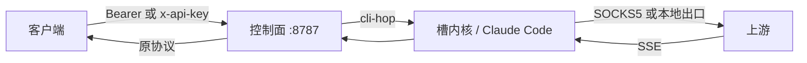

# 什么是 vm2api

vm2api 把 **Anthropic** 订阅（Claude Pro、Team、Enterprise 或 Max）或 **OpenAI** 订阅（ChatGPT / Codex）变成你自己机器上的普通 API。

调用方使用标准协议。后面的槽位在隔离容器里运行官方客户端；你选择真虚拟机时则是 KVM / QEMU。硬件身份（SMBIOS、MAC、machine-id）、网络出口和凭证都属于这个槽位。

本帮助站对照的产品树是 **1.3.131**。安装脚本跟随 GitHub 上的最新 Release，可能比这个版本新。

## 你拿到什么

| 你调用 | 上游 |
| --- | --- |
| `POST /v1/messages` | Anthropic Messages |
| `POST /v1/chat/completions` | OpenAI Chat |
| `POST /v1/responses` | OpenAI Responses |
| `GET /v1/models` | 这台网关上配置的模型目录 |

`POST /v1/completions` 会被接受，并转成一条 user 消息。`GET /health` 不需要密钥。

## 它不是什么

- 不是公共共享代理。你自己部署，自己导入账号。
- 不用手写 HTTP 栈去模拟官方客户端。Anthropic 流量走槽位里的真实 Claude Code 进程。
- 协议密钥（`sk-vm-…`）打不开管理 API。Master 密钥和已登录的管理台会话可以。

## 一次请求怎么走

上游 hop 始终是流式。客户端若设置 `stream: false`，网关会先拼成一个 JSON 再返回。

## 生产里要紧的九件事

1. **零提示词注入。** `zero` 布局不往系统提示里塞人设。仍可选 `official` 和 `official_full`。
2. **每个槽位自己的硬件身份。** SMBIOS、网卡 MAC 和 `/etc/machine-id` 属于槽位，不属于这台 VPS。
3. **官方 Claude Code 进程。** 二进制在槽内运行。控制面重启不会把它换掉。
4. **蒸馏与拒答防护。** 试图套取思维链的请求，以及上游 AUP 拒答，可以在网关被丢弃或缓存。
5. **一个槽位一条出口。** 远程 SOCKS5，或本地出口 `px-local`。生产环境拒绝没有可用出口的导入。
6. **协议清洗。** Messages、Chat、Completions、Responses 在进客户端之前先整流。
7. **遥测开关。** 官方遥测可以对齐一台普通开发机，也可以关掉。
8. **集群。** 管理台可以管多台 VPS。槽位终端是 WebSocket，nginx 必须正确转发 `Upgrade`。
9. **密钥与配额。** Master 密钥、签发的协议密钥、槽位并发，以及上游 5 小时 / 7 天窗口。

是否泄漏 CLI 身份的干净度测试在产品仓库 `docs/benchmarks/`。

## 下一步

- [快速开始](./quick-start) 安装控制面。
- [调用 API](./api) 是客户端契约。
- [槽位与账号](./slots) 说明一个账号怎样变成可调度。
